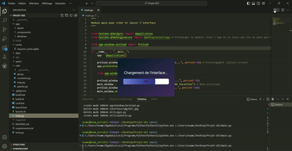

<div align="center">
    <h1>Projet-GES</h1>
    <center><center>
</div>

# 📗 Table des matières
- [📖 About the Project](#resume)
  - [🛠 Built With](#modules)
  - [🚀 Live Demo](#exemple-de-lancement)
- [💻 Getting Started](#utilisation)
  - [Install](#installation)
  - [launch](#lancement-du-projet)
  - [Constantes](#constantes)
- [👥 Authors](#auteurs)

# Résumé
<h3>Un projet en python qui permet d'afficher des graphiques montrant l'évolution de gaz a effet de serre dans un lieu.
Vous pourrez y trouver une carte montrant les émissions de gaz à effet de serre en France et dans les territoires français.</h3>

# Utilisation
- ## Modules
- Pour réaliser ce projet nous avons utilisé majoritairement les modules suivants :
  - [Pyside6]("https://pypi.org/project/PySide6/)
  - [Matplotlib]("https://matplotlib.org/stable/index.html)
  - [Folium]("https://pypi.org/project/folium/)

- ## Installation
  - Pour installer les dépendances requises par le projet, utilisez le fichier [launch.bat](launch.bat) sur windows ou [launch.sh](launch.sh)  si vous êtes sur un système d'exploitation Linux

  - ou la commande suivante dans votre terminal

```bash 
./launch.bat
```

  - Sinon pour installer les librairies vous pouvez aussi entrer la commande suivante dans votre terminal

```bash 
pip install r requirements.txt
```
- ## Lancement du projet
  - Pour lancer le projet vous pouvez exécuter cette commande dans le terminal à partir de la racine du projet
```bash
py main.py
```

- ## Constantes
  - Si vous le voulez, vous pouvez modifier les constantes dans le fichier [](utils/constants.py)
```python
# Chemin ROOT
ROOT_PATH: str = getattr(sys, '_MEIPASS', ".")

# Chemin vers les ressources (assets)
RESOURCE_PATH: str = f"{ROOT_PATH}\\app\\assets"

# Base du lien API
API_LINK: str = "https://data.ademe.fr/data-fair/api/v1/datasets/bilan-ges/"

# Expiration en seconde du cache des requetes (1H par defaut)
REQUEST_CACHE_EXPIRE: int = 60*60
```

## Exemple de lancement
<div align="center">
    <center></img>
</div>

## Auteurs

<div style="display: flex; align-items: center;">


<div>

  - *Nom :* Noam Chamouard  
  - *GitLab :* [mon profil](https://gitlab.univ-lr.fr/nchamoua)
</div>

</div>

<div style="display: flex; align-items: center; margin-top: 10px;">


<div>

- *Nom :* Axel Cvjetic  
- *GitLab :* [mon profil](https://gitlab.univ-lr.fr/acvjetic)
</div>

</div>

<div style="display: flex; align-items: center; margin-top: 10px;">


<div>

- *Nom :* Dimitri Ollivier  
- *GitLab :* [mon profil](https://gitlab.univ-lr.fr/dollivie)
</div>

</div>

<div style="display: flex; align-items: center; margin-top: 10px;">


<div>

- *Nom :* Iyanchrist Mugisha  
- *GitLab :* [mon profil](https://gitlab.univ-lr.fr/imugisha)
</div>

</div>